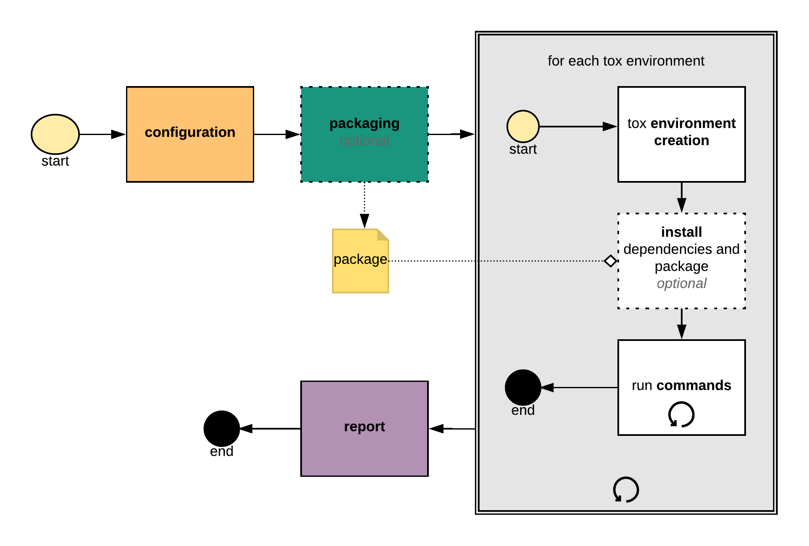

# Unit testing a production ML model

## Section overview

This section will apply previous lessons to a more realistic codebase.

## Code conventions

The codebase uses PEP8 style.

Codebase also uses type hints per PEP484.

F-strings per Pep498.

Some functions force keyword arguments so that argument names have to be supplied, e.g.:

```python
def my_func(*, foo):
    return foo

my_func(foo="bar")
```

## Pytest

### Fixtures

Functions like a super-charged version of `unittests` setup and teardown. They can be scoped at different levels of the project and passed to other fixtures.

```python
import pytest

@pytest.fixture
def input_value():
    return 4

def test_fixture(input_value):
    assert input_value == 4
```

Fixtures used across files can be put in `conftest.py` unless you specify a scope in the `@pytest.fixture` decorator.

### Parametrization

Using the `pytest.mark.parametrize` decorator, we can pass multiple parameters to a test.

```python
@pytest.mark.parametrize(
    'inputs', [2, 3, 4]
)
def test_square(inputs):
    # the items in 'inputs' are passed one at a time
    assert isinstance(inputs, int)
```

## Setup - Kaggle data

We download our dataset from [Kaggle](https://www.kaggle.com/c/house-prices-advanced-regression-techniques/data) and put it in `packages/gradient_boosting_model/gradient_boosting_model/datasets`, renaming `train.csv` to `houseprice.csv`.

## Setup - Tox

Tox creates (multiple) virtual environments for running tests in reproducible setups across different Python versions.

Tox is configured in the `tox.ini` file, e.g.:

```ini
[tox]
envlist = py37
skipsdist = True

[testenv]
deps = pytest
commands =
	pytest
```

Then the commands can be run by just running `tox`.



## Code-base overview

This overview is based on the state of the repo at [this commit](https://github.com/trainindata/testing-and-monitoring-ml-deployments/tree/01738f4ebade0824a31576747e0e4d5a0615e146).

The code-base is a mono-repo: there are multiple packages in one repository.

One package is `gradient_boosting_model`.

Dependencies of `gradient_boosting_model`:

- numpy, sklearn, pandas
- feature_engine (by Train In Data, the people that make the course)
- joblib will be used for serialization
- strictyaml for parsing yaml configs
- pydantic also for parsing
- marshmallow for creating a schema
- setuptools and wheel for packaging

### Modules of gradient boosting model

#### train_pipeline

This module contains the `run_training` method which loads data, divides it, fits the pipeline, and persists the pipeline for later transformation use.

#### pipeline

An sklearn pipeline. Encodes variables, drops unnecessary features, and contains the gradient boosting regressor as the final step.

#### config.yml

Specifies which features we expect, which features are categorical/numerical, which features cannot have missing data, train split proportions, random states, hyperparameters, and so on.

#### config

The config.yml is loaded by `config/core.py`. The `Config` class contains `ModelConfig` and `AppConfig`, all of which are Pydantic models.

#### predict

This module defines `make_prediction` which uses the `predict` function of our pipeline.

#### processing

Module containing various data and pipeline processing code.

##### data_management

Helpers for loading dataset and persisting dataset.

##### preprocessors

Steps which get fed into our pipeline and transform features.

##### validation

A Marshmallow schema for sanitizing and validating inputs. The aforementioned `make_predictions` function uses this to validate all input data before predicting.

##### errors

Defines custom exceptions.

## Preprocessing and feature engineering testing theory — why do this?

Feature engineering/preprocessing is the very top of the pipeline and so has the possibility to introduce issues before the model code even begins. Bugs in features can be almost impossible to detect further downstream.

Preprocessing code may also be designed by a DS team and implemented or productionized by a data engineering team, so testing ensures that expected behavior is maintained throughout this process.

### Examples:

- A feature is within a set scale (e.g. 0–1)
- Calculations are correct
- Missing data is correctly replaced
- Do distributions of transformed data match expectations?
- Are outliers handled as desired?

###### 